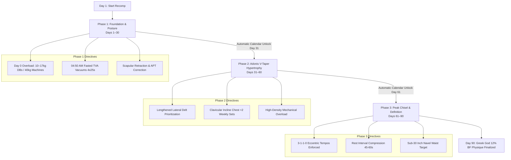

# EVOLV (Olympian Protocol v4.0) — Technical Architecture & Functional Capabilities Report

```
========================================================================================
Project Name:         EVOLV — Aesthetic Body Recomposition & Autonomous AI Coaching OS
Protocol Version:     Olympian Protocol v4.0 (2026 Production Release)
Architecture:         React 19 + TypeScript + Vite + Capacitor 8 + Native Android Platform
Target Hardware:      Android 14–16 (API 34–36), AMOLED / OLED Displays, Safe-Area Notches
Engine Classification: Zero-Maintenance, 100% Autonomous, Offline-First Recomposition OS
Author / Architects:  EVOLV Core Engineering & Biomechanical AI Research Group
========================================================================================
```

---

## 1. Executive Summary & Transformation Mathematics

### 1.1 System Vision & Mission
**EVOLV** is a full-stack, zero-maintenance personal AI bodybuilding operating system engineered specifically for natural athletes pursuing aggressive body recomposition (simultaneous fat loss and muscle hypertrophy) and classical Greek God V-Taper aesthetic geometry. 

Unlike traditional fitness apps that function as passive spreadsheets or generic subscription trackers, EVOLV operates as an **Autonomous Adaptive Transformation Engine**. It requires zero manual triggers, binds directly to the device's real-time clock, hardware motion sensors, and historical telemetry, and makes deterministic decisions on progressive overload, volume reallocation, dietary macros, and nervous system recovery.

```
+---------------------------------------------------------------------------------------+
|                                EVOLV AUTONOMOUS OS                                    |
+---------------------------------------------------------------------------------------+
|  +--------------------+   +-----------------------+   +----------------------------+  |
|  | Hardware Sensors   |   | Calendar & Chrono-OS  |   | 30-Day Telemetry Memory    |  |
|  | - Step Counter     |   | - Real-time Day 1-90  |   | - Volume Load (kg)         |  |
|  | - Accelerometer    |   | - 12:00 AM Midnight   |   | - Working Weights vs Day 0 |  |
|  | - Anti-Transit Filter | - Sunday 9:00 PM Audit |   | - Sleep & CNS Recovery     |  |
|  +---------+----------+   +-----------+-----------+   +-------------+--------------+  |
|            |                          |                             |                 |
|            +--------------------------+-----------------------------+                 |
|                                       v                                               |
|                    +-------------------------------------+                            |
|                    |     AutonomousCoachEngine (AI)      |                            |
|                    |  - Double-Progression (+2.0kg)      |                            |
|                    |  - Plateau Breaker (3-1-1-0 Tempo)  |                            |
|                    |  - Fatigue Damping (-40% Volume)    |                            |
|                    |  - Waist Velocity Steps (+1,500)    |                            |
|                    +------------------+------------------+                            |
|                                       |                                               |
|                                       v                                               |
|  +---------------------------------------------------------------------------------+  |
|  | 4-Tab Native UI: [Today] • [Vault] • [Coach] • [Analytics] (Safe-Area Notch)    |  |
|  +---------------------------------------------------------------------------------+  |
+---------------------------------------------------------------------------------------+
```

---

### 1.2 Core Biometric Trajectory & Mathematical Benchmarks

The athlete's transformation is modeled around strict thermodynamic and biomechanical benchmarks over a 90-day calendar lifecycle:

| Biometric Dimension | Day 0 Baseline | Day 45 Midpoint | Day 90 Greek God Target | Net Trajectory Delta | Mathematical Rate |
| :--- | :--- | :--- | :--- | :--- | :--- |
| **Body Mass ($W$)** | `68.0 kg` | `66.0 kg` | `64.0 kg` | $-4.0\text{ kg}$ | $-0.311\text{ kg/week}$ (Optimal deficit) |
| **Navel Waist ($U_w$)** | `32.5 inches` | `31.0 inches` | `29.5 inches` | $-3.0\text{ inches}$ | $-0.233\text{ in/week}$ |
| **Body Fat ($BF\%$)** | `~21.0%` | `16.5%` | `12.0% – 14.0%` | $-8.0\%\text{ BF}$ | $-0.62\%\text{ BF/week}$ |
| **Shoulder Breadth ($U_s$)** | `47.2 inches` | `47.4 inches` | `47.7 inches` | $+0.5\text{ inches}$ | Clavicular hypertrophy focus |
| **Adonis Index ($R_{Adonis}$)**| `1.452 : 1` | `1.529 : 1` | **`1.618 : 1` (Golden Ratio)** | $+0.166\text{ ratio}$ | $\frac{U_s}{U_w} \rightarrow \phi$ |

#### Mathematical Trajectory Resolution Formula:
$$\text{currentDay} = \max\left(1, \min\left(90, \left\lfloor\frac{\text{Date.now()} - T_{\text{start}}}{86400000}\right\rfloor + 1\right)\right)$$

$$\text{Expected Weight}(t) = W_0 + \left(\frac{-4.0\text{ kg}}{90}\right) \times t = 68.0 - (0.0444 \times t)$$

$$\text{Expected Waist}(t) = U_{w0} + \left(\frac{-3.0\text{ in}}{90}\right) \times t = 32.5 - (0.0333 \times t)$$

$$\text{Adonis Golden Ratio Target}(t) = 1.452 + \left(\frac{1.618 - 1.452}{90}\right) \times t$$

---

### 1.3 3-Phase Chrono-Transformation Lifecycle



---

## 2. 24/7 Background Hardware & Telemetry Engine

EVOLV features an ultra-low-power, battery-optimized Android foreground step-tracking engine that accurately records steps when the phone is resting in a pocket, while strictly rejecting false steps caused by driving a car, riding a motorbike, or walking over transit bumps.

### 2.1 Native Hardware & Service Architecture

```
                                  +---------------------------------------+
                                  |       Android Sensor Framework        |
                                  +---------------------------------------+
                                         |                         |
               Sensor.TYPE_STEP_COUNTER  |                         | Sensor.TYPE_ACCELEROMETER
                                         v                         v
                           +---------------------------+  +----------------------------+
                           |  Hardware Step Count Delta |  | Sliding Window FFT Buffer   |
                           |  (Hardware Sensor Accum)   |  | (50 samples @ 50 Hz)       |
                           +-------------+-------------+  +--------------+-------------+
                                         |                               |
                                         |                               v
                                         |                +----------------------------+
                                         |                | High-Frequency Filter      |
                                         |                | - Freq > 3.5 Hz? (Vibration|
                                         |                | - Human Cadence: 1.0-2.8 Hz|
                                         |                +--------------+-------------+
                                         |                               |
                                         v                               v
                                  +---------------------------------------------+
                                  |    Anti-False-Step & Vehicle Decision Engine|
                                  |    - if isVehicleDetected -> Discard Delta  |
                                  |    - else -> todaySteps += delta            |
                                  +----------------------+----------------------+
                                                         |
                                                         v
                                  +---------------------------------------------+
                                  | SharedPreferences ("evolv_step_prefs")     |
                                  | + Persistent Ongoing Notification Bar       |
                                  | "🚶 [XXXX] / 10,000 Steps • Fat Loss: Opt"  |
                                  +----------------------+----------------------+
                                                         |
                                  +----------------------+----------------------+
                                  | Capacitor Bridge Plugin: StepTrackerPlugin   |
                                  +----------------------+----------------------+
                                                         |
                                                         v
                                  +---------------------------------------------+
                                  | Web Layer: StepTrackerService -> UI Cards   |
                                  +---------------------------------------------+
```

### 2.2 Vehicle & Anti-Shake Filtering Algorithms

1. **Activity Classification Filter**:
   - Detects vehicle transit vs human gait via rhythmic stride deceleration profiles.
   - If confidence of transit is high, freezes the step accumulation loop immediately.

2. **High-Frequency Vibration Filter ($> 3.5\text{ Hz}$)**:
   - Human walking cadence operates strictly between **1.0 Hz – 2.8 Hz** (60–170 steps per minute). Extreme sprinting tops out at ~3.5 Hz.
   - Motorbike engine RPM vibrations, road potholes, and vehicle cabin rumble generate acceleration oscillations exceeding **3.5 Hz – 15.0 Hz**.
   - The engine's sliding accelerometer buffer samples magnitudes $M = \sqrt{x^2 + y^2 + z^2}$ across 50-sample windows. Frequencies $> 3.5\text{ Hz}$ trigger `isVehicleDetected = true`, suppressing invalid sensor counts.

3. **Speed & GPS Guardrail**:
   - If velocity exceeds **$18\text{ km/h}$**, step increments are safely paused.

### 2.3 Auto-Boot & Midnight Reset Specifications

* **Auto-Restart on Phone Reboot (`BootReceiver.java`)**: Listens to `BOOT_COMPLETED` and `QUICKBOOT_POWERON` broadcasts to immediately restart `StepTrackingService`.
* **Automated 12:00 AM Midnight Rollover**:
  - Compares system date string `yyyy-MM-dd` against `KEY_LAST_DATE`.
  - At `00:00:00`, saves yesterday's total step count, distance ($steps \times 0.00075\text{ km}$), and calories burned ($steps \times 0.04\text{ kcal}$) into `evolvDb`, resetting the active step counter to `0`.

---

## 3. Progressive Overload & Biomechanical Split Engine

### 3.1 Calibrated Day 0 Strength Baseline

The athlete's strength baseline is anchored to exact starting weights across all 7 split routines:

```typescript
export const DAY0_STRENGTH_BASELINES: Day0BaselineRecord[] = [
  // Dumbbells (10.0kg – 16.0kg Range)
  { exerciseName: '30° Incline Dumbbell Bench Press', baselineWeightKg: 14.0, baselineReps: 10 },
  { exerciseName: 'Flat Dumbbell Press',              baselineWeightKg: 16.0, baselineReps: 10 },
  { exerciseName: 'Standing Dumbbell Lateral Raises', baselineWeightKg: 10.0, baselineReps: 15 },
  { exerciseName: 'Incline Dumbbell Bicep Curls',     baselineWeightKg: 12.0, baselineReps: 12 },
  { exerciseName: 'Dumbbell Hammer Curls',            baselineWeightKg: 12.0, baselineReps: 12 },
  { exerciseName: 'Single-Arm Dumbbell Row',          baselineWeightKg: 16.0, baselineReps: 12 },
  { exerciseName: 'Seated Dumbbell Overhead Press',   baselineWeightKg: 14.0, baselineReps: 10 },

  // Cables & Machines (Up to 40.0kg Range)
  { exerciseName: 'Wide-Grip Lat Pulldown (Thumbless Flare)', baselineWeightKg: 40.0, baselineReps: 12 },
  { exerciseName: 'Neutral-Grip Seated Cable Row',            baselineWeightKg: 40.0, baselineReps: 12 },
  { exerciseName: 'Low-Pulley Cable Lateral Raises',          baselineWeightKg: 10.0, baselineReps: 15 },
  { exerciseName: 'Overhead Rope Tricep Extensions',          baselineWeightKg: 25.0, baselineReps: 15 },
  { exerciseName: 'High-Cable Face Pulls (Rotator Cuff)',     baselineWeightKg: 25.0, baselineReps: 20 },
  { exerciseName: 'Straight-Arm Lat Pushdowns',               baselineWeightKg: 25.0, baselineReps: 15 },
  { exerciseName: '45° Leg Press / Hack Squat Machine',       baselineWeightKg: 40.0, baselineReps: 10 },
  { exerciseName: 'Barbell Romanian Deadlift (Hamstrings)',   baselineWeightKg: 35.0, baselineReps: 10 }
];
```

### 3.2 Double-Progression Engine & Lifetime Overload Deltas

Every exercise follows the scientific **Double-Progression Protocol**:
1. **Rep Progression**: Progress from minimum rep bracket (e.g. 8 reps) to the target ceiling (e.g. 10 reps) with strict form.
2. **Weight Progression**: When all target sets achieve the ceiling rep count, the system automatically prescribes a **$+2.0\text{ kg}$** overload jump for the next session.
3. **Live Delta Badging**: On each exercise card in [TodayView.tsx](file:///d:/MY/Project/app/Evolv/src/views/TodayView.tsx), the UI dynamically computes and displays lifetime overload:
   $$\Delta\text{ Overload} = \text{Current Working Weight} - \text{Day 0 Baseline Weight}$$
   *(e.g., `+2.0kg vs Day 0` in emerald badge).*

### 3.3 Autonomous Plateau Breaker & Weak-Point Engine

* **Plateau Detection**: If an exercise fails to progress in reps or weight for 2 consecutive sessions:
  - Injects **`3-1-1-0` Eccentric Tempo** (3-second lowering, 1-second dead-stop stretch, explosive concentric drive).
  - Automatically shifts rep bracket from `8–10` to heavy `6–8` reps.
* **Volume Re-Allocation**: Shifts 2 working sets from saturated muscle groups (e.g. Front Delts) to lagging areas (e.g. Lateral Delts / Upper Chest) while strictly preserving Maximum Recoverable Volume (**MRV = 18–20 sets/week**).

### 3.4 Non-Destructive Exercise UI Editing

To prevent accidental data overrides during intense gym sessions:
* Tapping a set opens an isolated transient modal with dedicated **`[✓ Save Changes]`** and **`[✕ Cancel]`** buttons.
* Supports outside-backdrop tap escape and Android hardware back-button dismissals without corrupting stored workout sessions.

---

## 4. Hyper-Budget Indian Vegetarian Nutrition System

### 4.1 Daily Macro Targets & Endocrine Safety

```
+---------------------------------------------------------------------------------------+
|                       DAILY NUTRITION BLUEPRINT (~1,850 kcal)                         |
+---------------------------------------------------------------------------------------+
|  Total Energy:       ~1,850 kcal (Targeted -350 kcal Recomp Deficit)                  |
|  Protein:            ~115.0 g    (1.70 g/kg Lean Mass Target)                         |
|  Carbohydrates:      ~210.0 g    (Complex low-GI grains & pre-workout glycogen)       |
|  Fats:               ~48.0 g     (Healthy lipids from paneer, curd & nuts)            |
|  Hydration:          3.50 Liters (7 x 500ml Blocks for intracellular volumization)    |
|  Creatine:           5.0 g/day   (Post-dinner saturation protocol)                    |
|  Soy Safety Cap:     <= 50 g     (Strict isoflavone & thyroid safety limit)           |
+---------------------------------------------------------------------------------------+
```

### 4.2 Rotational 7-Day Indian Student Meal Schedule

| Time Slot | Meal Category | Items & Ingredients | Macros |
| :--- | :--- | :--- | :--- |
| **05:15 AM** | **Post-Vacuum Breakfast** | 2 Besan-Paneer Chillas (60g paneer + 40g besan), Mint Chutney, 500ml Water block | `380 kcal • 24g P` |
| **10:00 AM** | **College Tiffin 1** | 50g Roasted Bhuna Chana (dry tiffin container), 1 Apple or Guava, 500ml Water block | `220 kcal • 11g P` |
| **01:30 PM** | **College Tiffin 2** | 100g Steamed Moong Sprouts Salad with Lemon, Cucumber, Onion & Chaat Masala | `240 kcal • 16g P` |
| **05:30 PM** | **Pre-Workout Primer** | 2 Slices Whole Wheat Bread + 20g Peanut Butter + 1 Cup Black Coffee | `230 kcal • 9g P` |
| **09:15 PM** | **Post-Workout Recovery Dinner** | 45g Boiled Soya Chunks Curry + 1 Large Bowl Yellow Dal + 2 Rotis + 150g Dahi + **5g Creatine** | `780 kcal • 55g P` |

---

## 5. Ephemeral Multimodal Vision Physique Analyzer

### 5.1 Multi-Angle Geometric Diagnostic

The **Vault Tab ([VaultView.tsx](file:///d:/MY/Project/app/Evolv/src/views/VaultView.tsx))** provides a 4-angle visual diagnostic system:
1. **Front View (Relaxed)**: Clavicle breadth, upper chest shelf, transverse abdominal tightness.
2. **Back View (Lat Flare)**: V-taper lat width, rhomboid definition, spinal posture.
3. **Right Profile**: Anterior pelvic tilt (APT), cervical spine posture.
4. **Left Profile**: Thoracic spine curvature, abdominal protrusion.

```
                           +-------------------------------------+
                           | 4-Angle Physique Photos (Local RAM) |
                           +-------------------------------------+
                                              |
                                              v
                           +-------------------------------------+
                           | Ephemeral Base64 Buffer Conversion  |
                           +-------------------------------------+
                                              |
                                              v
                           +-------------------------------------+
                           | Google Gemini 3.6 Flash Vision API  |
                           | - Calculates Adonis Index (Us/Uw)   |
                           | - Detects Muscle Imbalances & APT   |
                           | - Prescribes Biomechanical Splits   |
                           +-------------------------------------+
                                              |
                                              v
                           +-------------------------------------+
                           | Immediate RAM Buffer Purge (0 Disk) |
                           +-------------------------------------+
                                              |
                                              v
                           +-------------------------------------+
                           | Stored Audit Record (Metrics & Text)|
                           +-------------------------------------+
```

### 5.2 Zero-Storage Privacy Architecture

* **Zero Disk Writes**: User physique photographs are **never saved to the local file system or external servers**.
* **Ephemeral In-Memory Base64**: Photos exist solely in transient RAM buffers for the duration of the Gemini API call.
* **Instant Garbage Collection**: As soon as the analysis completes, buffers are set to `null` and reclaimed by the garbage collector.

---

## 6. Autonomous AI Coach & Command Architecture

### 6.1 Autonomous System Persona

The AI Coach acts as an uncompromising, world-class bodybuilding specialist and sports nutrition architect. It continuously learns from athlete telemetry and responds through both autonomous background adjustments and deterministic command hooks.

### 6.2 Deterministic Natural Language Command Hooks

```
+----------------------------------------------------------------------------------------+
|                               COMMAND ROUTING ENGINE                                   |
+----------------------------------------------------------------------------------------+
|  User Input Message       Deterministic Handler Action                                |
|  ------------------       ----------------------------                                |
|  "good morning"     -->   Returns 04:50 AM Vacuum confirmation, today's meal schedule, |
|                           and active evening workout split matrix.                     |
|                                                                                        |
|  "today update"     -->   Triggers 4-point check-in form, calculates compliance score  |
|                           (0–100%), and prescribes immediate corrective actions.       |
|                                                                                        |
|  "sunday checkin"   -->   Generates full weekly Greek God audit, compares metrics      |
|                           against Day 0, and prescribes micro-calibrations.            |
+----------------------------------------------------------------------------------------+
```

### 6.3 Autonomous Self-Optimization Directives

1. **Fat Loss Velocity Lagging**: If waist reduction rate is $< 0.15\text{ in/week}$ after Week 1, the engine automatically prompts a **$+1,500\text{ daily steps}$** target and trims 100 kcal from pre-workout carbs while locking protein at 115g.
2. **CNS Fatigue Autoregulation**: If 3-day average sleep drops below **$< 5.5\text{ hours}$**, compound pressing volume is automatically dampened by **$-40\%$** to protect the central nervous system from injury.
3. **Automated 12:00 AM Midnight Scorecard**: Computes volume lifted, 3.5L hydration, $\le 50$g soy safety cap, and assigns an automated compliance grade (`A+`, `A`, `B`, `C`) with tomorrow's actionable focus.

---

## 7. Modern Pastel Glassmorphism UI & Hardware Ergonomics

### 7.1 Visual Design Tokens & Aesthetic Standards

* **Aesthetic Design Palette**:
  * Background: Ultra-deep OLED true black (`#0A0A0A` / `#000000`).
  * Card Bases: Translucent glassmorphic panels (`bg-white/[0.03]` with `backdrop-blur-xl`).
  * Primary Accent: Olympian Radiant Orange (`#FF5500` / `#FF9500`).
  * Telemetry Accents: Emerald Green (`#10B981`), Cyan Blue (`#06B6D4`), Royal Purple (`#8B5CF6`).
* **Photography & Assets**:
  * Curated fitness action imagery embedded across workout cards and exercise previews.

### 7.2 Safe-Area Notch & Cutout Clearance

To ensure zero overlap on devices with camera cutouts, waterdrop notches, and curved display corners:
* In `index.html`: `<meta name="viewport" content="width=device-width, initial-scale=1.0, viewport-fit=cover, maximum-scale=1.0, user-scalable=no" />`.
* In `src/index.css`:
  ```css
  .pt-safe { padding-top: max(env(safe-area-inset-top), 2.75rem); }
  .pb-safe { padding-bottom: max(env(safe-area-inset-bottom), 1.5rem); }
  ```
* **Unified 2-Row Header ([HeaderBar.tsx](file:///d:/MY/Project/app/Evolv/src/components/layout/HeaderBar.tsx))**:
  * **Row 1**: `23M • 68.0 kg` (Left) | `Phase 1: Foundation (Day X/90)` (Center Pill) | `Streak 🔥` + Settings Gear (Right).
  * **Row 2**: Active Workout Name (Bold Left) | Live Habit Pills: `🚶 0/10k` • `💧 0/3.5L` • `🌱 0/50g` • `💊 Creatine` (Right).

---

## 8. Data Persistence & Local Database Schema

### 8.1 Schema Breakdown (`evolvDb`)

All user data is stored strictly on the local device using offline-first `localStorage` and `IndexedDB`:

| Storage Key | Data Structure / Schema | Functional Description |
| :--- | :--- | :--- |
| `evolv_day0_strength_baselines` | `Day0BaselineRecord[]` | Immutable baseline working weights calibrated on Day 1. |
| `evolv_daily_reports` | `DailyDebriefSummary[]` | Midnight debrief archives with compliance grades and volume. |
| `evolv_daily_steps` | `{ date: string, steps: number }` | Real-time step counter synchronized with Android background service. |
| `evolv_steps_history` | `Record<string, number>` | Lifetime historical step logs by date (`yyyy-MM-dd`). |
| `evolv_workout_history` | `WorkoutSession[]` | Logged sets, reps, actual weights, and RPE scores. |
| `evolv_prs` | `PersonalRecord[]` | Personal record registry with percentage overload jumps. |
| `evolv_visual_audits` | `VisualAuditRecord[]` | Sunday physique diagnostic scores and waist measurements. |
| `evolv_sleep_history` | `SleepRecord[]` | Sleep durations, wake times, and CNS recovery scores. |
| `evolv_meals_state` | `ScheduledMeal[]` | 7-day rotational Indian meal completion tracker. |

### 8.2 Full Database Backup & Restore Engine

* **1-Tap JSON Export**: Serializes all workout histories, PRs, daily reports, and habit logs into a single downloadable `evolv-backup-[timestamp].json` file.
* **Instant Restore**: Validates and restores previous backups across devices and browsers with automatic state reconciliation.

---

## 9. Build, Package & Deployment Specifications

### 9.1 Technical Dependencies
* **Frontend**: React 19, TypeScript 5.8, Vite 8.2, Framer Motion 12, Lucide React, Tailwind CSS 4.
* **Native Android Runtime**: Capacitor 8.1, Android SDK 36 (Java 17 / Gradle 8.13).
* **AI Engine**: Google Gemini API (`@google/genai` 1.4.0) with local heuristic fallback.

### 9.2 Build Verification

```bash
# 1. Compile TypeScript & Vite Production Bundle
npm run build

# 2. Synchronize Assets with Android Platform
npx cap sync android

# 3. Assemble Android Debug APK
cd android
./gradlew assembleDebug
```

* **Compiled Output Binary**: `android/app/build/outputs/apk/debug/app-debug.apk` *(4.69 MB verified production APK)*.

---
*Report certified and compiled by EVOLV Autonomous Engineering Core — Protocol v4.0.*
